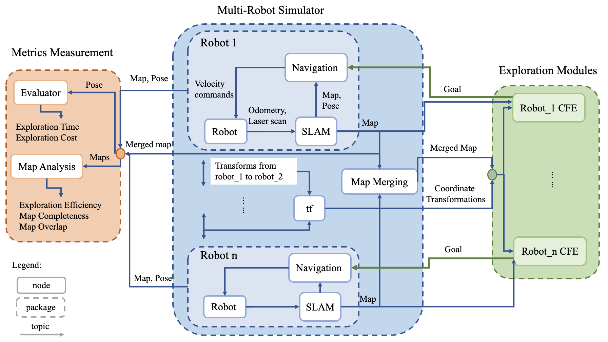

# Coordinated Frontier-based Exploration for Multi-Robot
The CFE module equips robots with the strategy of pursuing frontiers through utility, a function of cost, discount and information gain.
This is the brain of the fully autonomous multi robot exploration system. 

For simulation, three other modules/repos are required.
- [mrs_env_simulator](https://github.com/takoyakee/mrs_env_simulator): Simulation of robots and indoor environments on Gazebo
- [fyp_commands](https://github.com/takoyakee/fyp_commands): Shell commands (run in this order: env.sh, run.sh, stats.sh, save.sh)
- [env_stats](https://github.com/takoyakee/env_stats): Analysis of map overlap (as measure of efficiency) *optional

For detailed instruction on simulation, refer to <a href="simulation.pdf" target="_blank">simulation</a>
 which walk through the files and commands needed.

For detailed documentation, refer to <a href="paper" target="_blank">paper</a> which was written in fulfillment of the ME BEng Dissertation.

